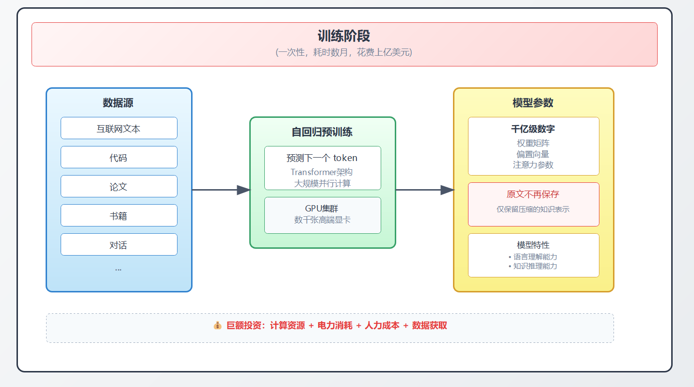
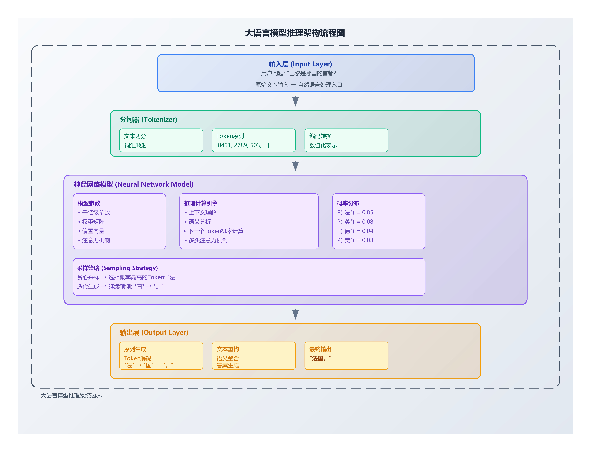
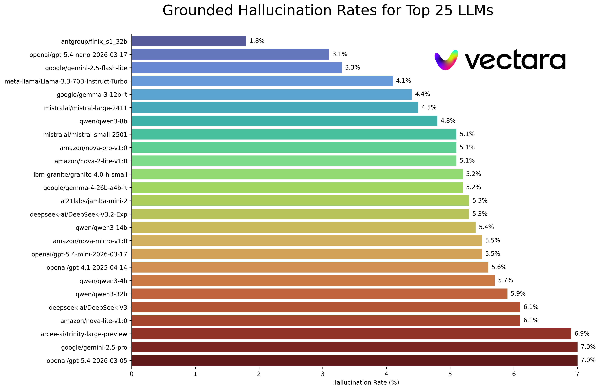
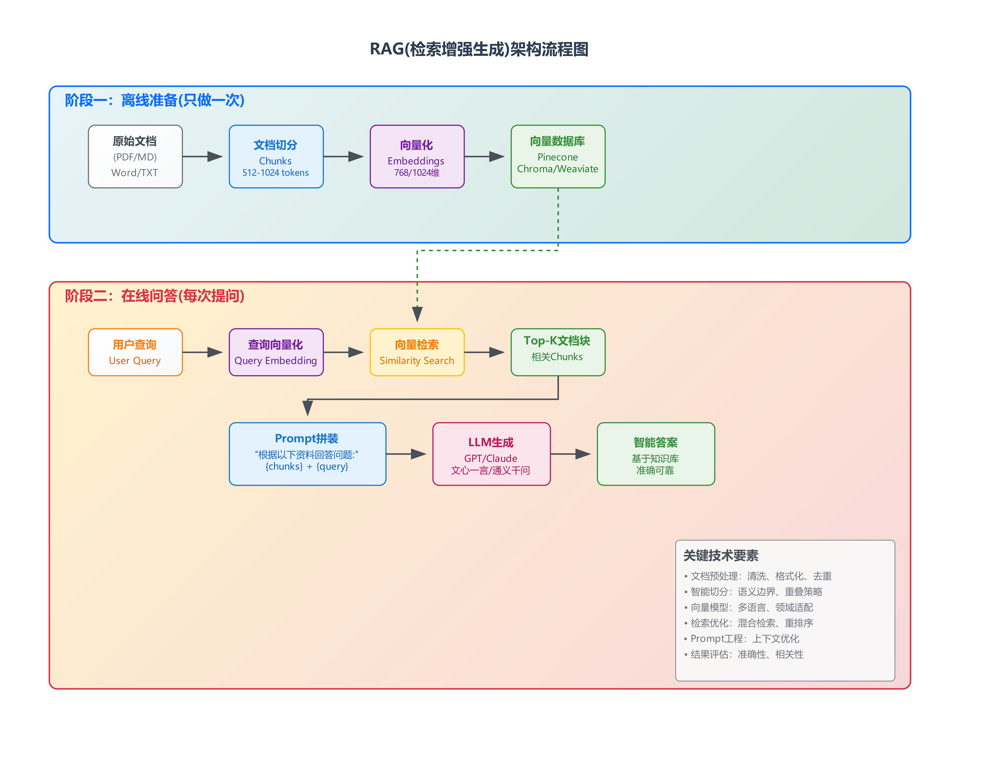
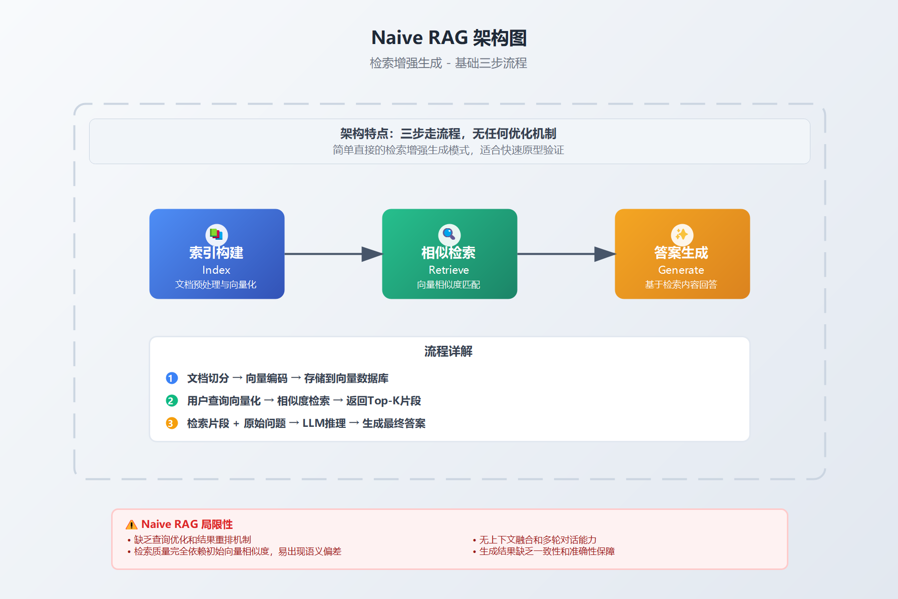
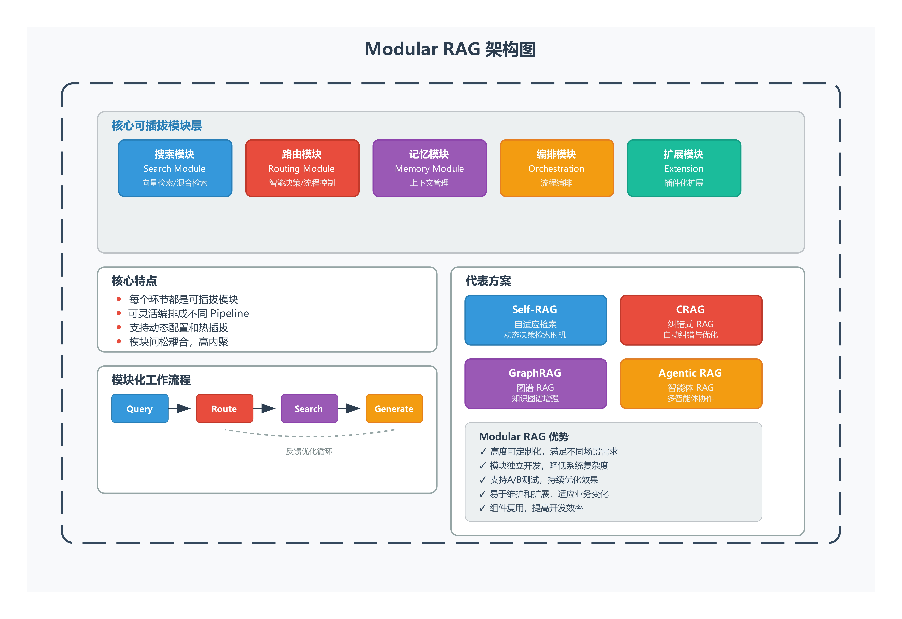
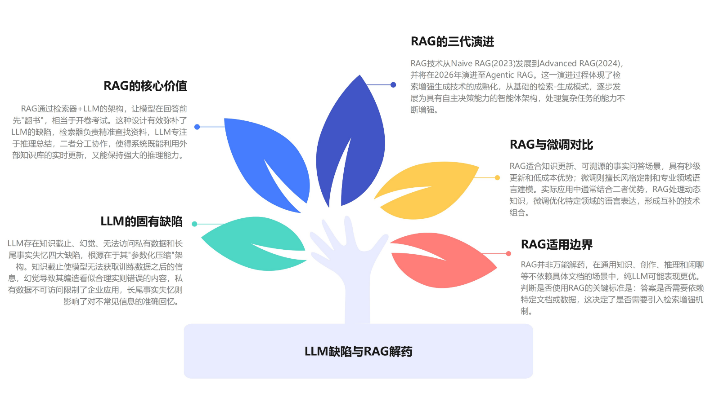

# 第 1 章:为什么需要 RAG —— 从 LLM 的"先天缺陷"说起

### 第 1 章:为什么需要 RAG <a href="#di-1-zhang-wei-shen-me-xu-yao-rag" id="di-1-zhang-wei-shen-me-xu-yao-rag"></a>

> LLM 是有近视眼"的天才,RAG 是给它配一副专业眼镜。

#### 1.1 LLM 到底是怎么"知道"东西的 <a href="#id-11llm-dao-di-shi-zen-me-andquot-zhi-dao-andquot-dong-xi-de" id="id-11llm-dao-di-shi-zen-me-andquot-zhi-dao-andquot-dong-xi-de"></a>

要理解为什么 LLM 会幻觉,必须先理解一件反直觉的事:**LLM 并不"记得"它训练时读过的文本**。

很多人有个误解,觉得 LLM 像一个超级搜索引擎——你问问题,它去内部数据库里"查"答案。**完全不是**。

LLM 的工作机制更像下面这个比喻:

> 一个人读了一万本书,然后**把所有书烧掉**,只凭脑子里残留的印象,在你提问时一个字一个字地"猜"答案。

这个"残留印象"在技术上叫**参数化记忆**(parametric memory)。需要注意的是:**模型参数并不是原始文本的压缩存档,而是从文本中习得的语言模式与知识的抽象表征**。原始文本在训练后**不复存在**——这一点对理解后面所有 RAG 的设计动机都至关重要。

**1.1.1 训练阶段:文本如何变成参数**

🎨 **图 1-1:LLM 训练的本质**



预训练的核心任务非常单调:**给定前面 N 个 token,预测下一个 token 是什么**。

举个例子:训练数据中有一句"巴黎是法国的首都"。模型反复学习:

* 看到"巴黎是" → 应预测"法"
* 看到"巴黎是法" → 应预测"国"
* 看到"巴黎是法国" → 应预测"的"
* 以此类推

经过数千亿次这样的训练,模型**没有真的"记住"这句话**,而是调整了内部参数,**使得"巴黎是"后面跟"法国的首都"的概率分布达到峰值**。

**1.1.2 推理阶段:模型如何"回答"**

🎨 **图 1-2:LLM 推理的本质**



> ⚠️ **图示说明**:上述概率为示意性描述,真实 token 分布受上下文长度、温度参数(temperature)、top\_p 等采样策略影响。同一个模型在不同采样设置下,对同一问题的输出可能不同。

注意三个关键点:

1. **没有"查找"过程**。模型没有去任何数据库里"查"巴黎的首都——它只是基于参数计算了一个概率分布。
2. **输出是概率采样的结果**。每次回答可能略有不同(取决于采样参数)。
3. **没有"真假"的概念**。模型不知道"巴黎是法国首都"是真的——它只知道这个 token 序列在训练数据中出现的相对频率高。

**这就是幻觉的根源**:当训练数据中**没有**或**很少**出现某个事实,模型仍然会生成最"合理"的 token 序列——**而合理 ≠ 真实**。

***

#### 1.2 LLM 的缺陷 <a href="#id-12llm-de-que-xian" id="id-12llm-de-que-xian"></a>

理解了 LLM 的工作原理,缺陷就顺理成章了。

**缺陷 1:幻觉(Hallucination)**

**定义**:模型生成事实错误但表面看起来合理的内容。

**为什么必然存在**:训练目标是"生成像人类的文本",不是"说真话"。这两者**不等价**。

**学术分类**:Ji 等人在 2023 年 ACM Computing Surveys 上的综述 _Survey of Hallucination in Natural Language Generation_ 提出了被广泛采用的分类:

*   **Intrinsic Hallucination**(内在幻觉):生成内容**与源(source)内容矛盾**

    > 例:源文档说"伊波拉疫苗于 2019 年获 FDA 批准",模型输出"伊波拉疫苗于 2019 年被 FDA 拒绝"
*   **Extrinsic Hallucination**(外在幻觉):生成内容**无法被源内容验证**(不一定矛盾,但找不到依据)

    > 例:源文档没有提到中国的疫苗研发进展,模型输出"中国已完成疫苗的临床试验"

> 📚 **完整引用**:Ji, Z., Lee, N., Frieske, R., Yu, T., Su, D., Xu, Y., Ishii, E., Bang, Y. J., Madotto, A., & Fung, P. (2023). _Survey of Hallucination in Natural Language Generation_. ACM Computing Surveys, 55(12), Article 248. DOI: 10.1145/3571730 (arXiv: 2202.03629)

📖 **真实案例**

```
用户问: "请介绍蒋勋《细说红楼梦》中关于林黛玉的章节,
        引用 3 段原文。"

模型回答(节选):
"蒋勋在《细说红楼梦》第七讲中专门讨论了林黛玉..."
"原文写道:『黛玉之美,在于她的孤傲与脆弱并存...』"

实际情况:
- 蒋勋的《细说红楼梦》是讲解音频整理稿,
  不会有这种"原文引用"格式
- 具体讲次的内容也对不上
- 引用的所谓"原文"是模型编造的
```

**主流模型在 2026 年的幻觉率到底有多高?**

Vectara 公司维护着业界公认的 Hallucination Leaderboard。**重要背景**:Vectara 在 2025 年底到 2026 年初做了一次重大升级——把测试数据从约 1000 篇短文档扩展到 7700+ 长文档(最长 32K tokens),覆盖法律、医疗、金融、技术等领域。**新榜单上,所有模型的幻觉率都比旧榜单显著上升**。



> ⚠️ **重要说明**(读者必读):
>
> 1. 上述数据测量的是**有源文档的摘要任务**中的幻觉率,**不是开放问答**。
> 2. 推理模型(reasoning models)在新版数据集上幻觉率**反而更高**——它们花更多算力"思考",但思考过程也会引入更多虚构内容。这是 2026 年初业界开始关注的一个反直觉现象。
> 3. **此表数据来自 Vectara 2026-4-20 新版榜单**,请在阅读时去 GitHub 查阅最新数字。

**在没有源文档的开放问答场景下,幻觉问题会严重得多**。这一点没有单一数字可以精确量化(取决于问题类型、领域、模型),但研究和工程实践都表明:在开放域问答中,模型一旦遇到训练数据中稀有的事实,就会进入"自信地编造"模式。可参考 TruthfulQA 等基准的相关测试结果。

**缺陷 2:知识截止(Knowledge Cutoff)**

**定义**:模型只知道训练数据收集截止日期之前的信息。

**为什么必然存在**:重训一次大模型耗资数千万到上亿美元,无法实时更新。

**主流模型的知识截止日期**(截至本书撰写时,出版前请你逐个在官方文档核实):

📖 **典型表现**:

```
问: "2027 年诺贝尔物理学奖颁给了谁?"

不联网的模型回答(理想状态):
"很抱歉,我的知识截止于 XXXX 年 XX 月,
 无法回答之后发生的事件。建议查阅最新新闻。"

但很多模型不"知道自己不知道",会直接编造一个看起来合理的答案。
```

**缺陷 3:私域知识缺失**

**定义**:模型对未公开发布在互联网的信息一无所知。

**为什么必然存在**:训练数据来自公开互联网。模型不知道:

* 你公司的内部规章制度
* 你产品的具体参数和价格
* 客户的个人信息和历史交互
* 任何在防火墙后面的资料

📖 **案例**:

```
问: "我们公司新员工试用期是几个月?"

LLM 没有数据,只能瞎猜:
"通常公司试用期是 1-3 个月,但具体应咨询 HR..."

(无用的废话)
```

**缺陷 4:长尾事实失忆**

**定义**:模型对训练数据中出现频率低的事实经常记错。

**为什么必然存在**:模型是基于统计的学习器,出现频率低的事实在参数中表征弱。

**学术证据**:Kandpal 等人在 ICML 2023 发表的论文 _Large Language Models Struggle to Learn Long-Tail Knowledge_ 通过实证证实:**模型对一个事实的掌握程度,与该事实在预训练数据中关联文档的数量呈强相关关系**。论文使用实体链接技术统计每个 QA 问题在预训练语料中的关联文档数,在 TriviaQA 等多个基准上观察到清晰的"长尾失忆"现象。

> 📚 **完整引用**:Kandpal, N., Deng, H., Roberts, A., Wallace, E., & Raffel, C. (2023). _Large Language Models Struggle to Learn Long-Tail Knowledge_. Proceedings of the 40th International Conference on Machine Learning (ICML), PMLR 202: 15696-15707. (arXiv: 2211.08411)

📖 **直观案例**:

* "巴黎是法国首都" → 训练数据中出现频次极高 → 模型几乎不会答错
* "马其顿首都是斯科普里" → 出现频次中等 → 偶有混淆
* "瓦努阿图首都是维拉港" → 出现频次极低 → 经常瞎编

更糟的是,**论文指出**:即使把模型规模放大几个数量级,长尾知识的掌握度提升也很有限——这意味着"长尾失忆"不能靠堆参数解决,**必须靠 RAG 这样的外挂机制**。

***

#### 1.3 RAG 是什么:一句话的定义 <a href="#id-13rag-shi-shen-me-yi-ju-hua-de-ding-yi" id="id-13rag-shi-shen-me-yi-ju-hua-de-ding-yi"></a>

RAG = Retrieval-Augmented Generation,**检索增强生成**。

> 在 LLM 生成答案之前,先从一个外部知识库中检索相关信息,作为额外上下文提供给 LLM。

🎨 图 1-3:RAG 的标准工作流



**核心理念**:让 LLM 在回答前,先"翻书"。

类比:

* 传统 LLM ≈ 闭卷考试,只能凭脑子
* RAG ≈ 开卷考试,允许查阅参考书

开卷考试在大多数事实性问题上,准确率通常远高于闭卷。

***

#### 1.4 RAG 怎么解决这四个缺陷 <a href="#id-14rag-zen-me-jie-jue-zhe-si-ge-que-xian" id="id-14rag-zen-me-jie-jue-zhe-si-ge-que-xian"></a>

RAG 不是万能,但它对这四个缺陷都有针对性的解法:

🎨 图 1-4:RAG vs 四大缺陷

.png>)

**1.4.1 不是所有问题都需要 RAG**

工程上一个常见误区:把 RAG 当"万能解药"。实际上有些问题用 RAG 反而是杀鸡用牛刀:

```
不需要 RAG 的场景:
─────────
- 通用知识问答("2 + 2 等于几"、"Python 怎么读 CSV")
- 创作类任务(写诗、生成代码骨架)
- 推理类任务(数学证明、逻辑分析)
- 闲聊

需要 RAG 的场景:
─────────
- 基于私有/最新数据的问答
- 需要给出来源的场景
- 事实性强、容错率低的领域(法律、医疗、金融)
- 需要复用同一份知识库服务大量用户
```

判断方法:**这个问题的答案,是否依赖于某份具体的文档/数据**。是 → 用 RAG;否 → 不用。

***

#### 1.5 一个最小可运行的 RAG <a href="#id-15-yi-ge-zui-xiao-ke-yun-xing-de-rag" id="id-15-yi-ge-zui-xiao-ke-yun-xing-de-rag"></a>

为了让你对 RAG 有具体印象,这一节给一个 30 行代码的最小 RAG。能用,但不强。

python

```python
# 最小 RAG:30 行代码
from openai import OpenAI
from sentence_transformers import SentenceTransformer
import numpy as np

client = OpenAI()
embedder = SentenceTransformer("BAAI/bge-small-zh-v1.5")

# 1. 知识库(简化为列表)
documents = [
    "公司员工年假天数:工龄 1-10 年 5 天,10-20 年 10 天,20 年以上 15 天",
    "公司加班工资:工作日 1.5 倍,休息日 2 倍,法定节假日 3 倍",
    "公司报销额度:出差住宿 500 元/晚,餐饮 100 元/餐,交通按实报销",
]

# 2. 文档向量化(只做一次)
doc_embeddings = embedder.encode(documents)

# 3. 检索 + 生成
def rag_answer(query: str) -> str:
    # 把 query 也向量化
    query_emb = embedder.encode(query)

    # 算余弦相似度,找最相关的 1 条
    scores = doc_embeddings @ query_emb / (
        np.linalg.norm(doc_embeddings, axis=1) * np.linalg.norm(query_emb)
    )
    top_doc = documents[scores.argmax()]

    # 把材料和问题一起喂给 LLM
    response = client.chat.completions.create(
        model="gpt-4o-mini",
        messages=[
            {"role": "system", "content": "只用下面的资料回答。资料里没有就说不知道。"},
            {"role": "user", "content": f"资料:{top_doc}\n\n问题:{query}"}
        ]
    )
    return response.choices[0].message.content

# 4. 用一下
print(rag_answer("我工龄 5 年,有几天年假?"))
# 预期输出:根据资料,工龄 1-10 年的员工有 5 天年假。
```

这就是 RAG 的核心结构——**Embedding + 相似度检索 + 加 context 调 LLM**。

但这个最小版本有非常多问题:

* 只检索 Top-1,容易漏关键信息
* 没考虑 chunk 边界(整段当一个 chunk 不合理)
* 没考虑 hybrid 检索(纯向量在某些场景不够)
* 没 prompt 工程
* 没引用标注
* 没评估机制
* 没观测、没安全、没合规

本书后面 12 章,每一章解决其中一类问题。

***

#### 1.6 RAG 的三代演进 <a href="#id-16rag-de-san-dai-yan-jin" id="id-16rag-de-san-dai-yan-jin"></a>

到 2026 年,RAG 已经从最初的"检索+生成"演化到第三代。

**图 1-5:Naive RAG 架构**



**典型流程**:

1. 文档简单切块(常用固定长度)
2. 用通用 embedding 模型向量化
3. 用余弦相似度检索 Top-K
4. 把 Top-K 拼进 Prompt 让 LLM 生成

**它能解决什么**:基础的"基于文档问答"场景。 **它解决不了什么**:

* 用户 query 表达模糊时召回不准
* 检索结果鱼龙混杂(相关性差)
* 答案质量随机性大
* 完全没有评估反馈

**1.5.2 第二代:Advanced RAG(进阶 RAG)**

🎨 **图 1-6:Advanced RAG 架构**


**核心改进**:在 Naive RAG 的检索前后**加优化模块**,提升召回和精度。

**代表技术**(本书第 6 章详述):

* **HyDE**:用假设答案检索
* **RAG-Fusion**:多查询融合
* **混合检索**:语义 + 关键词
* **Cross-Encoder Reranker**:精排

**这一代是目前商业落地的主力**。本书 70% 的篇幅围绕 Advanced RAG。

**1.5.3 第三代:Modular RAG(模块化 RAG)**

🎨 **图 1-7:Modular RAG 架构**



**核心改进**:从"线性流水线"变成"模块化网络",支持复杂场景的 RAG。

**典型场景**:

* 多源知识库混合(向量库 + 关系数据库 + 知识图谱)
* 需要多步推理的复杂问答
* 需要工具调用的 Agentic 任务&#x20;

本书前 11 章主要讲第一代和第二代——这是当前生产环境的主流。第 13 章会展开第三代和未来方向。

注:"几代 RAG"这种划分是社区讨论中的一种归类方式,\
没有严格的学术定义。各家说法不完全一致,\
本书采用这种三代划分是为了方便读者建立心智模型。

***

#### 1.7 RAG vs 微调:工程师的常见纠结 <a href="#id-17ragvs-wei-tiao-gong-cheng-shi-de-chang-jian-jiu-jie" id="id-17ragvs-wei-tiao-gong-cheng-shi-de-chang-jian-jiu-jie"></a>

每次讲 RAG,总有人问:"为什么不直接微调?"

🎨 图 1-8:RAG vs 微调对比

.png>)

工程上的常见路径:

```
1. 先用 RAG 解决 80% 问题
2. 如果遇到 RAG 解决不了的(风格、专业语言),
   再考虑微调
3. 最佳实践通常是 RAG + 微调结合
```

不要陷入"RAG 还是微调"的二选一。它们解决的是不同问题。

***

#### 1.8 RAG 的工程价值 <a href="#id-18rag-de-gong-cheng-jia-zhi" id="id-18rag-de-gong-cheng-jia-zhi"></a>

为什么 2024-2026 年所有大厂、所有 AI 应用,都在搞 RAG?

🎨 图 1-9:RAG 在 AI 工程栈中的位置

.png>)

RAG 是连接"LLM 能力"和"业务数据"的中间层。没有这层,LLM 就是空有强大的语言能力但接不上业务的"博士生";有了这层,LLM 才能成为"懂业务的专家"。

工程上 RAG 的价值:

```
1. 解锁私有数据的 LLM 应用
   企业的所有内部知识,都可以变成"AI 能查的库"

2. 控制成本与可靠性
   通过 RAG,LLM 只需要"小而准"的 context
   不用为每个用户单独微调

3. 提供可溯源能力
   每个答案都能给出引用
   合规、审计、信任的基础

4. 持续学习,无需重训
   知识库更新 = 系统能力更新
   不需要 GPU、不需要训练数据准备
```

***

#### 1.9 本书路线图 <a href="#id-19-ben-shu-lu-xian-tu" id="id-19-ben-shu-lu-xian-tu"></a>

本书围绕"如何造一个生产级 RAG"展开:

```
第一部分:基础(2-5 章)
─────────────────────────
Ch 2 文档预处理:RAG 的地基
Ch 3 Embedding:让机器懂语义
Ch 4 向量数据库与 ANN:让检索快
Ch 5 Prompt 工程:让 LLM 用好材料

第二部分:进阶(6-9 章)
─────────────────────────
Ch 6 Advanced RAG 七大技巧
Ch 7 商业化优化三板斧
Ch 8 RAG 可观测性
Ch 9 评估体系:RAGAS

第三部分:工程化(10-13 章)
─────────────────────────
Ch 10 主流框架横评
Ch 11 工程化与上线
Ch 12 安全与合规
Ch 13 前沿与展望
```

工程师可以按顺序读,也可以按需跳读:

* **刚入门**:Ch 2, 3, 5(基础三件套)
* **已经有 RAG demo**:Ch 6, 8, 9(优化 + 监控 + 评估)
* **要上线**:Ch 11, 12(工程化 + 合规)

***

#### 1.10 本章小测验 <a href="#id-110-ben-zhang-xiao-ce-yan" id="id-110-ben-zhang-xiao-ce-yan"></a>

不看答案先想。

1. LLM 的固有缺陷是什么?各自的根因是?
2. RAG 怎么解决"幻觉"问题?能完全消除吗?
3. 哪些场景适合用 RAG?哪些不适合?判断标准是什么?
4. 用 30 行代码写一个最小 RAG,需要哪些组件?
5. RAG 三代演进各自的特点?
6. RAG 和微调的本质差异是什么?在什么场景下应该选哪个?
7. 为什么"知识截止"不是某个具体模型的 bug?根因是什么?
8. "推理 ≠ 检索"具体指什么?这个差异为什么是 RAG 价值的核心来源?
9. 如果一个项目用了 GPT-5(假设有更长的 context 和更强的能力),还需要 RAG 吗?
10. 你接到一个需求:"做一个能回答公司财报问题的 AI 助手"。给出 RAG vs 微调 vs 纯 LLM 的方案对比和选择理由。

<details>

<summary>👉 参考答案</summary>

1. 知识截止(训练数据有时间边界)、幻觉(参数化压缩信息有损)、无法访问私有数据(没参与过训练)、推理 ≠ 检索(LLM 擅长推理不擅长精准查找)。根因都是 LLM 的"参数化压缩"架构。
2. RAG 通过在 prompt 里明确指示"只用提供的材料,材料里没有就说不知道",大幅压制了 LLM 的"自由发挥"。幻觉率通常能从 20%+ 降到 5% 以下,但不能完全消除——LLM 仍可能在没材料时硬答,或在多份材料矛盾时编造。
3. 适合:基于私有/最新数据的问答、需要给出来源、事实性强容错低的领域、需要复用同一份知识库服务大量用户。不适合:通用知识问答、创作类、推理类、闲聊。判断标准:答案是否依赖于某份具体的文档/数据。
4. Embedding 模型(把文本变向量)+ 知识库(可以是简单列表)+ 相似度检索(余弦距离)+ LLM(基于材料生成)。
5. 第一代 Naive RAG:简单 pipeline,单一向量检索。第二代 Advanced RAG:Query 改写 + 混合检索 + Reranker + 上下文压缩。第三代 Agentic RAG:LLM 主导决策,多轮检索 + 工具调用 + 自我反思。
6. 本质差异:RAG 通过"外挂材料"补充知识;微调通过"改模型参数"内化知识。RAG 适合知识频繁更新、需要溯源的场景;微调适合风格定制、专业领域语言学习。生产中常常 RAG + 微调结合。
7. 因为"训练数据有时间边界"是 LLM 架构的固有特性——模型必须在某个时间点完成训练。即使 GPT-5、Claude 4 也只是把 cutoff 往后推一些,但永远存在 cutoff。
8. 推理是"基于已知信息得出结论",检索是"精准定位某份具体材料"。LLM 把所有知识"压缩"在参数里,要它回忆"某文档第 7 章第 3 条第 2 款"这种细节,会失真或编造。检索器专门做"精准找到材料"这件事,然后让 LLM 基于材料推理——各做擅长的事。
9. 仍然需要。原因:(1)知识截止问题永远存在;(2)私有数据永远不会进入模型训练;(3)长 context 推理速度慢、成本高,RAG 通过精选材料能让 LLM 只看小而准的 context;(4)可溯源的要求只有 RAG 能满足。GPT-5 让 RAG 更好做,但取代不了。
10. 方案对比:纯 LLM——不可行(财报是私有数据,模型不知道);微调——成本高(每季度财报更新都要重训)、不可溯源(财报问答需要精确数字);RAG——最合适(财报入库即可、可溯源、成本可控)。推荐方案:用 RAG 为主,如果发现 LLM 不擅长财报特有的表达(如"营业利润率""归母净利润"),可以考虑用少量数据微调一个针对性模型,RAG + 微调结合。

</details>

***

#### 1.11 本章总结 <a href="#id-111-ben-zhang-zong-jie" id="id-111-ben-zhang-zong-jie"></a>


