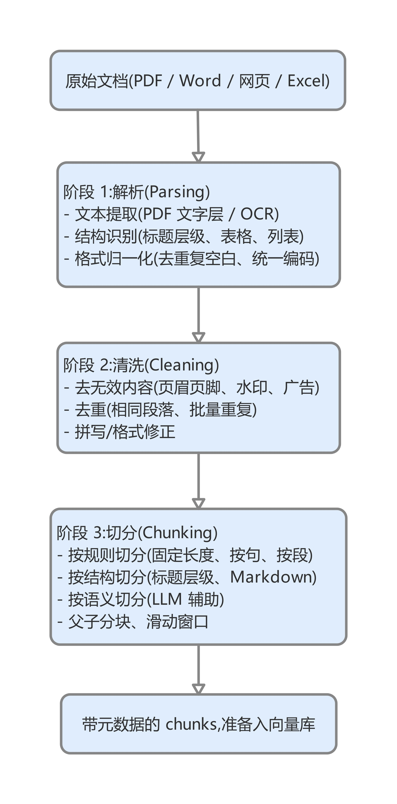
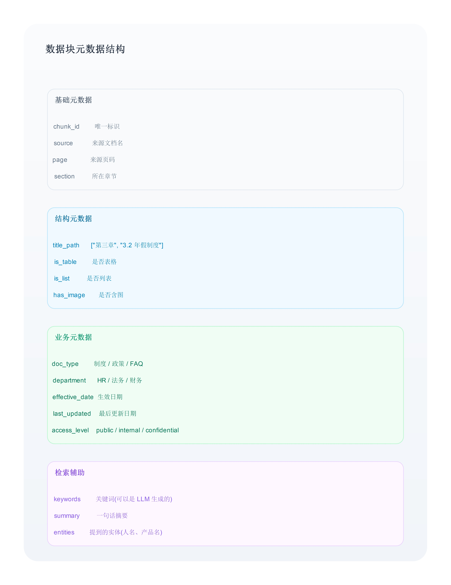
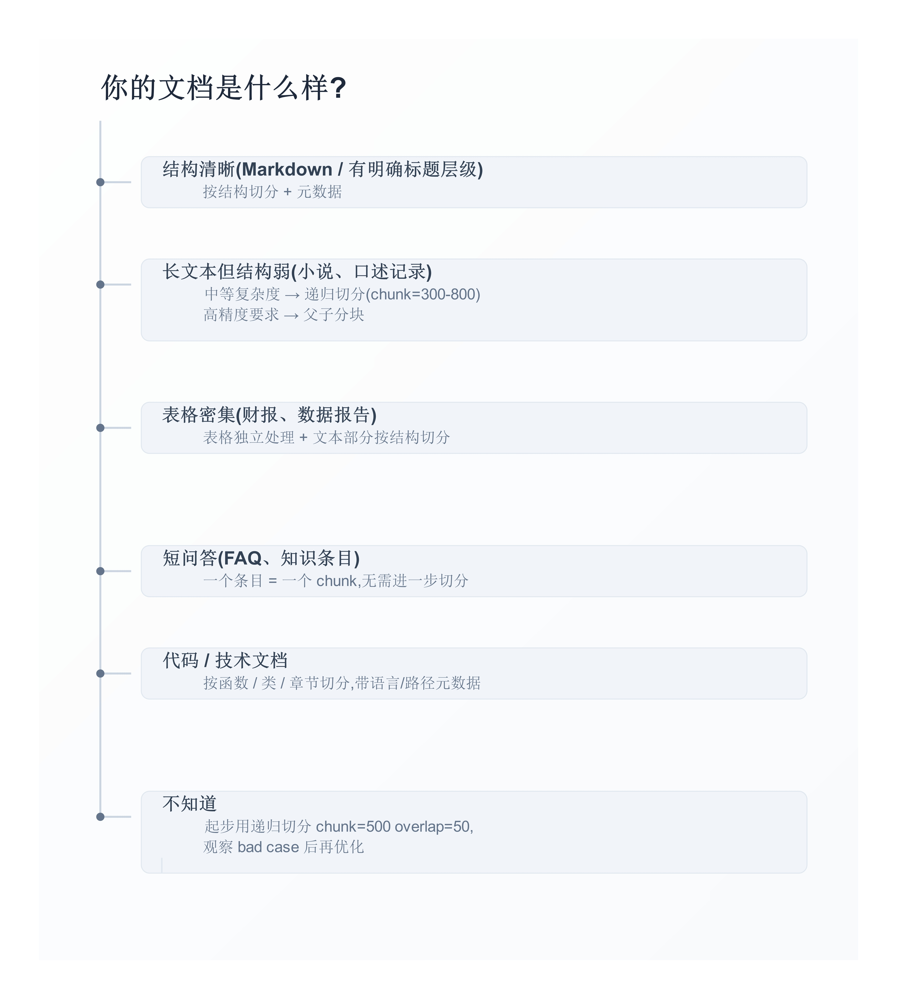

# 第 2 章:文档预处理 —— RAG 的地基


> Chunk 切得好不好,直接决定 RAG 的天花板。这一章是最被低估、却最有 ROI 的环节。

#### 2.1 一个常被忽视的真相 <a href="#id-21-yi-ge-chang-bei-hu-shi-de-zhen-xiang" id="id-21-yi-ge-chang-bei-hu-shi-de-zhen-xiang"></a>

📖 场景:某团队搞 RAG 半年,准确率一直上不去 75%。Embedding 换了 3 个,Reranker 试了 4 个,Prompt 改了几十版。

最后发现问题在最初的一步——**chunk 切分**:

* 用的是默认 `chunk_size=500, overlap=50`
* 跨章节、跨小标题切碎
* 表格切散
* 列表项分离

把切分方式改成"基于结构 + 父子分块"之后,准确率从 73% 跳到 86%。

工程上一个常被低估的事实:**RAG 系统的天花板,通常在文档预处理这一步就定了**。后面所有优化都是在这个天花板下挣扎。

***

#### 2.2 文档预处理的三个阶段 <a href="#id-22-wen-dang-yu-chu-li-de-san-ge-jie-duan" id="id-22-wen-dang-yu-chu-li-de-san-ge-jie-duan"></a>

🎨 图 2-1:文档预处理的完整流程

<figure><figcaption></figcaption></figure>

工程现实:大多数团队的精力都在"切分"环节,而"解析"和"清洗"被严重忽视。但实际项目中,**解析阶段的失败往往是后续所有问题的根源**——比如表格被切散、PDF 页眉混入正文、扫描版 PDF 没 OCR。

***

#### 2.3 文档解析:第一道关 <a href="#id-23-wen-dang-jie-xi-di-yi-dao-guan" id="id-23-wen-dang-jie-xi-di-yi-dao-guan"></a>

不同格式的文档,解析复杂度天差地别。

**2.3.1 PDF 的"假文本"陷阱**

PDF 是 RAG 工程中最常踩坑的格式。

🎨 图 2-2:PDF 的三类难度

.png>)

**2.3.2 一个真实失败案例:中文招股书**

📖 某团队做"基于招股书的投研问答 RAG"。第一版用 pdfplumber 解析 200 份招股书入库,Recall@5 仅 42%。

分析失败原因:

```
失败 1:表格散开
  招股书里大量"营业收入按地区/产品/客户"的表格,
  pdfplumber 把它们解析成无意义的文字串。
  原表格:
    地区   | 营业收入 | 占比
    华东   | 12.5亿  | 45%
    华北   | 8.3亿   | 30%
  pdfplumber 输出:
    "地区 营业收入 占比 华东 12.5 亿 45% 华北 8.3 亿 30%"
  → 用户问"华东占比多少",检索召回的是这堆混乱字符串

失败 2:多栏混乱
  招股书前面通常是双栏中文,后面是单栏英文
  pdfplumber 把双栏内容按 Y 坐标乱序输出
  → 一句话被切成"上半句来自左栏、下半句来自右栏"

失败 3:页眉页脚混入
  每页都有"招股说明书 · 2024 · 第 X 页"
  这种文字混入每个 chunk
  → 检索时这些重复字符串成为噪声

修复方案:
  - 换 MinerU(2024 年开源的版面解析工具)
  - 表格单独提取并转 Markdown
  - 页眉页脚用规则过滤
  → Recall@5 提升到 76%
```

工程教训:

* PDF 不是统一格式,不同 PDF 复杂度差异巨大
* 通用工具在复杂版面 PDF 上通常不够
* 前期投入版面解析的工程力,后期省去无数 Recall 优化

**2.3.3 主流 PDF 解析工具对比**

| 工具              | 优势       | 适合场景          |
| --------------- | -------- | ------------- |
| pdfplumber      | 简单稳定     | 简单文字层 PDF     |
| PyMuPDF (fitz)  | 快、API 丰富 | 中等复杂度         |
| MinerU          | 中文友好、版面强 | 中文复杂版面(论文、报告) |
| Marker          | 英文版面强    | 英文论文          |
| RAGFlow DeepDoc | 端到端      | 企业级、商用        |
| LlamaParse      | 商业 API   | 不想自己维护        |
| Unstructured    | 多格式支持    | 杂格式混合         |

⚠️ 【需要核实】:工具迭代快,出版前查各项目 GitHub 的最新状态。

**2.3.4 表格的特殊处理**

表格是 PDF 解析中最难、也最关键的部分。工程上几种常见做法:

```
策略 1:表格转 Markdown
  适合:简单表格(行列规整)
  优势:LLM 能直接理解 Markdown 表格
  工具:pdfplumber 的 extract_tables + 后处理

策略 2:表格转 HTML
  适合:复杂表格(合并单元格、嵌套)
  优势:保留结构信息
  劣势:LLM 处理 HTML 表格效果不如 Markdown

策略 3:表格 + 描述文本 双份入库
  适合:数据型表格
  做法:
    - 原始表格入库(精确查询用)
    - 用 LLM 生成自然语言摘要也入库
      "本表显示 2024 年公司在华东、华北的营业收入..."
  优势:语义检索能命中

策略 4:表格转 SQL(结构化)
  适合:大量同结构的数据表格
  做法:从 PDF 抽取后入数据库,用 Text-to-SQL 查询
  优势:精确计算、聚合
  劣势:工程复杂
```

***

#### 2.4 文档清洗 <a href="#id-24-wen-dang-qing-xi" id="id-24-wen-dang-qing-xi"></a>

清洗是被严重忽视的环节。一份没清洗的语料,后面所有优化都事倍功半。

**2.4.1 三类需要清洗的内容**

🎨 图 2-3:常见的"垃圾内容"

.png>)

**2.4.2 清洗的工程实践**

python

```python
import re

def clean_text(text: str) -> str:
    """文档清洗常见操作"""
    # 1. 去重复换行
    text = re.sub(r'\n{3,}', '\n\n', text)

    # 2. 去不可见字符
    text = re.sub(r'[\x00-\x08\x0b-\x0c\x0e-\x1f\xa0]', '', text)

    # 3. 全角转半角(看场景)
    # text = text.translate(str.maketrans(
    #     '0123456789ABCDE', '0123456789ABCDE'))

    # 4. 去常见页眉页脚模式
    text = re.sub(r'第\s*\d+\s*页\s*/\s*共\s*\d+\s*页', '', text)
    text = re.sub(r'机密\s*\|\s*请勿外传', '', text)

    # 5. 多个空格合并为一个
    text = re.sub(r' {2,}', ' ', text)

    return text.strip()

def remove_duplicates(chunks: list[str], threshold: float = 0.95) -> list[str]:
    """基于 hash 或编辑距离去重"""
    seen = set()
    result = []
    for c in chunks:
        # 用 normalized 后的内容做 hash
        normalized = re.sub(r'\s+', '', c)
        h = hash(normalized)
        if h not in seen:
            seen.add(h)
            result.append(c)
    return result
```

清洗策略要看语料的具体特征。**没有通用的清洗代码**,每个项目都需要针对自己语料做定制规则。

***

#### 2.5 切分策略 <a href="#id-25-qie-fen-ce-le" id="id-25-qie-fen-ce-le"></a>

切分(Chunking)是文档预处理的核心。不同切分策略对 Recall 影响显著。

**2.5.1 五种主流切分策略**

🎨 图 2-4:五种切分策略对比

.png>)

**2.5.2 实测对比**

在本书 chapter02\_experiment 仓库,我们对 4 种切分策略做了对比实测。

**实验配置**:

| 项            | 设置                        |
| ------------ | ------------------------- |
| 文档语料         | 模拟企业 HR 制度,8488 字符        |
| 评测集          | 50 题(覆盖 easy/medium/hard) |
| Embedding 模型 | bge-small-zh-v1.5         |
| Top-K        | 1, 3, 5                   |
| 评测指标         | Recall@K                  |
| 随机种子         | `np.random.seed(42)`      |
| Python 版本    | 3.12                      |
| 仓库位置         | `chapter02_experiment/`   |

📊 表 2-1:四种切分策略的 Recall 对比

```
切分策略                Recall@1   Recall@3   Recall@5
─────────────────────  ────────   ────────   ────────
固定长度 (chunk=300)    98%        100%       100%
按句切分                94%        100%       100%
递归切分 (chunk=500)    88%        96%        100%
父子分块                82%        94%        100%
```

⚠️ **重要警示**:上表数据看起来"固定长度最好",但这是**评测方法决定的结论**。详细分析见下一节。

**2.5.3 反直觉发现:为什么"父子分块"看起来最差?**

📖 实验数据初看挺反直觉:固定长度 Recall@1 = 98%,父子分块 = 82%。难道父子分块这种"高级技巧"反而不如最 naive 的固定长度?

**深入分析后发现:这是评测方式的偏差**。

```
评测集是用"原文关键词"判断 Recall 的:
  题:"工龄 5 年的年假是几天?"
  期望关键词:["工龄 1-10 年", "5 天"]

固定长度 chunk=300:
  chunk 短,关键词出现频率高
  Top-1 容易包含"工龄 1-10 年 5 天"
  → 98% Recall@1

父子分块:
  子 chunk 用于检索,父 chunk 用于喂 LLM
  评测只看检索结果(子 chunk),不看最终给 LLM 的内容
  子 chunk 短,父 chunk 长
  评测时父 chunk 没参与,所以"看起来"不如固定长度
  → 82% Recall@1
```

工程教训:

* 评测方法决定结论。同一个系统,不同评测方法可能得出相反结果
* 父子分块的真实价值在"喂给 LLM 的内容完整性",而不是检索 Recall
* 必须做端到端评测(第 9 章 RAGAS),才能看到不同切分策略的真实差异

**2.5.4 父子分块的工程价值**

🎨 图 2-5:父子分块的工作方式

.png>)

工程上,父子分块在中等复杂度文档上通常比单一切分效果更好。本书的 chapter06\_experiment(第 6 章)会用更严谨的端到端评测复测这一点。

***

#### 2.6 元数据:被严重低估的金矿 <a href="#id-26-yuan-shu-ju-bei-yan-zhong-di-gu-de-jin-kuang" id="id-26-yuan-shu-ju-bei-yan-zhong-di-gu-de-jin-kuang"></a>

切完 chunk,只有文本是不够的。元数据(metadata)的重要性常被忽视。

**2.6.1 该带哪些元数据**

🎨 图 2-6:Chunk 的典型元数据



**2.6.2 元数据的工程价值**

主要价值有三个:

```
1. Filter(过滤)
   "只搜 HR 部门的、2024 年之后生效的"
   通过元数据 filter 大幅提升检索精度

2. Reranker 辅助
   除了语义相似度,还能用元数据加权
   "和当前用户部门一致的优先"

3. 引用与可解释性
   答案能给出"来自第 X 章 / 第 Y 页"
   合规和审计的必要条件
```

工程上,元数据丰富度通常决定 RAG 系统的"高级感"。一个只有 (chunk\_id, text) 的简陋 RAG,和一个有 15 个元数据字段的完整 RAG,在用户体验上是两个东西。

***

#### 2.7 切分策略的选型 <a href="#id-27-qie-fen-ce-le-de-xuan-xing" id="id-27-qie-fen-ce-le-de-xuan-xing"></a>

🎨 图 2-7:切分策略选型决策



工程上,**没有放之四海皆准的切分参数**。每个项目都需要根据自己的文档特征调试。

但有几个可以借鉴的经验值:

* `chunk_size` 通常在 200-1000 字符之间。太小语义不完整,太大检索精度下降
* `overlap` 通常是 `chunk_size` 的 10-20%。作用是避免句子被切断
* 中文 1 字符 ≈ 2 token,英文 1 字符 ≈ 0.25 token。计算 token 限制时要换算

***

#### 2.8 三个失败案例 <a href="#id-28-san-ge-shi-bai-an-li" id="id-28-san-ge-shi-bai-an-li"></a>

**2.8.1 失败案例 1:chunk 太小,语义破碎**

📖 某团队做客服 FAQ RAG,设 `chunk_size=100`,认为"小颗粒检索更精准"。

结果:很多答案需要跨多个 chunk 才完整,但检索只能召回 Top-K,经常召回了答案的一半。例如用户问"怎么申请退款?",召回了"退款需要提供订单号"但没召回"退款会在 3-5 个工作日到账"——两条都需要,但只召回一条。

修复:`chunk_size` 改到 500,Recall@5 提升 12 个百分点。

**2.8.2 失败案例 2:跨章节切碎**

📖 某团队做企业制度 RAG,用固定长度切分。结果一个 chunk 跨了两个章节——前半截是"年假",后半截是"加班"。

检索"年假怎么算"时召回了这个混合 chunk,LLM 看到的 context 是"年假...+ 加班...",答案变得混乱。

修复:换成按结构切分(用 Markdown 标题层级),每个 chunk 至少不跨章节。Recall 提升不明显但 LLM 答案质量显著提升。

**2.8.3 失败案例 3:表格被切散**

📖 某团队做财报 RAG,用 LangChain 的 RecursiveCharacterTextSplitter 切分。一个营业收入表格被切成 3 个 chunk:

* chunk 1:表头
* chunk 2:前 5 行数据
* chunk 3:后 5 行数据 + 表注

用户问"2024 年华东的营业收入是多少",检索到 chunk 2 但没召回表头,LLM 看到一堆没有列名的数字,无法回答。

修复:表格单独处理,整张表作为一个 chunk(配合表头转 Markdown)。同时为表格生成自然语言摘要也入库,用于语义检索。

***

#### 2.9 本章小测验 <a href="#id-29-ben-zhang-xiao-ce-yan" id="id-29-ben-zhang-xiao-ce-yan"></a>

不看答案先想。

1. 文档预处理的三个阶段是什么?哪个阶段最被低估?
2. PDF 解析的三类难度是什么?各自的应对策略?
3. 为什么"基于固定长度切分"在我们的 Recall@1 评测中看起来比"父子分块"好?
4. 父子分块的工程价值在哪里?为什么 Recall 评测体现不出来?
5. 列出 4 种主流切分策略,各自的适用场景。
6. 元数据有什么作用?列出至少 5 类常见元数据。
7. 中文 PDF 解析的常见三大坑是什么?
8. 你正在做一个法律合同 RAG,切分应该选什么策略?为什么?
9. chunk\_size 太小和太大,各自会带来什么问题?
10. 你接手一个 RAG 项目,准确率长期 60% 上不去。怎么诊断是不是切分的锅?

<details>

<summary>👉 参考答案</summary>

1. 解析、清洗、切分。其中"解析"和"清洗"最被低估,大多数团队精力都在切分。但实际上解析阶段的失败往往是后续所有问题的根源(表格切散、PDF 页眉混入、扫描版没 OCR 等)。
2. 文字层 PDF(用 pdfplumber/PyMuPDF 直接读);扫描版 PDF(必须 OCR,推荐 PaddleOCR/RapidOCR/商业 API);复杂版面 PDF(需要专用版面解析工具如 MinerU/DeepDoc/Marker)。
3. 因为评测集用"原文关键词匹配"判断 Recall。固定长度 chunk 短,关键词出现密度高,Top-1 容易命中。父子分块的子 chunk 短,父 chunk 没参与评测,所以"看起来"不如固定长度。这是评测方法决定的结论。
4. 父子分块的真实价值在"喂给 LLM 的内容完整性"——用小的子 chunk 做精准检索,用大的父 chunk 喂 LLM 保证上下文完整。Recall 评测只看检索结果(子 chunk),看不到最终给 LLM 的内容(父 chunk)。需要做端到端评测(RAGAS)才能看到真实差异。
5. 固定长度切分(简单场景,可预测);按句切分(保留句子完整性);递归切分(通用场景);按结构切分(Markdown/标题层级,语义完整);语义切分(LLM 辅助,慢但语义最完整)。
6. 作用:filter(过滤检索范围)、reranker 辅助(元数据加权)、引用与可解释性。常见类别:基础(chunk\_id, source, page),结构(title\_path, is\_table, has\_image),业务(doc\_type, department, effective\_date, access\_level),检索辅助(keywords, summary, entities)。
7. (1)表格散开(行列错位变成无意义字符串);(2)多栏布局乱序(双栏被按 Y 坐标乱序输出);(3)页眉页脚混入(每个 chunk 都带"机密"水印或页码)。
8. 法律合同适合"按结构切分 + 父子分块"。理由:合同有清晰的条款结构(第几条第几款),按结构切分能保证不跨条款;条款常需要联系上下文理解(如"前述条款"),父子分块让 LLM 看到完整条文。同时元数据要带"合同方、生效日期、条款编号"。
9. 太小:语义不完整、跨 chunk 的信息丢失、检索容易召回"半截答案"。太大:检索精度下降、塞进 LLM 的噪声多、超过 embedding 模型的 max\_length。通常 200-1000 字符,具体看文档类型和 embedding 模型限制。
10. 诊断步骤:(1)看 bad case——把准确率低的问题挑出来,看检索召回的 chunk 长什么样;(2)看 chunk 是否切碎(语义不完整、跨章节、表格切散);(3)看 chunk 是否过大(embedding 被截断);(4)做实验——固定切分参数不变,看 Recall@1/3/5 的差距;Recall@5 显著高于 Recall@1 说明切分大致 OK 但 Top-1 精度不够(加 Reranker);Recall@5 也低说明切分有问题(重切)。

</details>

***

#### 2.10 本章总结 <a href="#id-210-ben-zhang-zong-jie" id="id-210-ben-zhang-zong-jie"></a>

<figure><figcaption></figcaption></figure>
