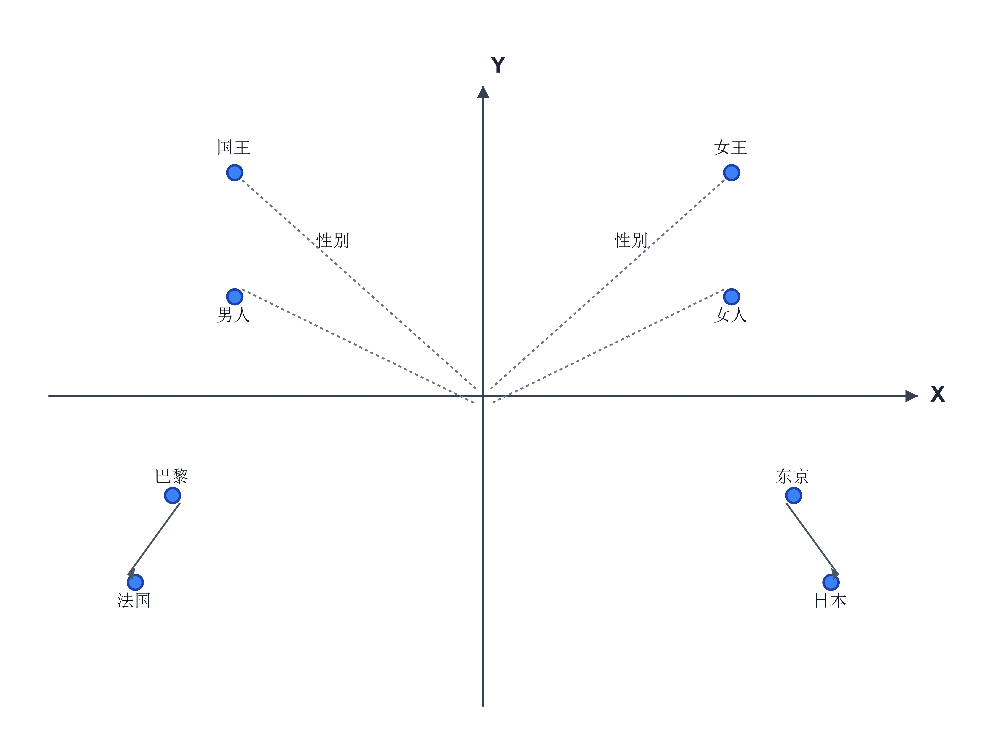
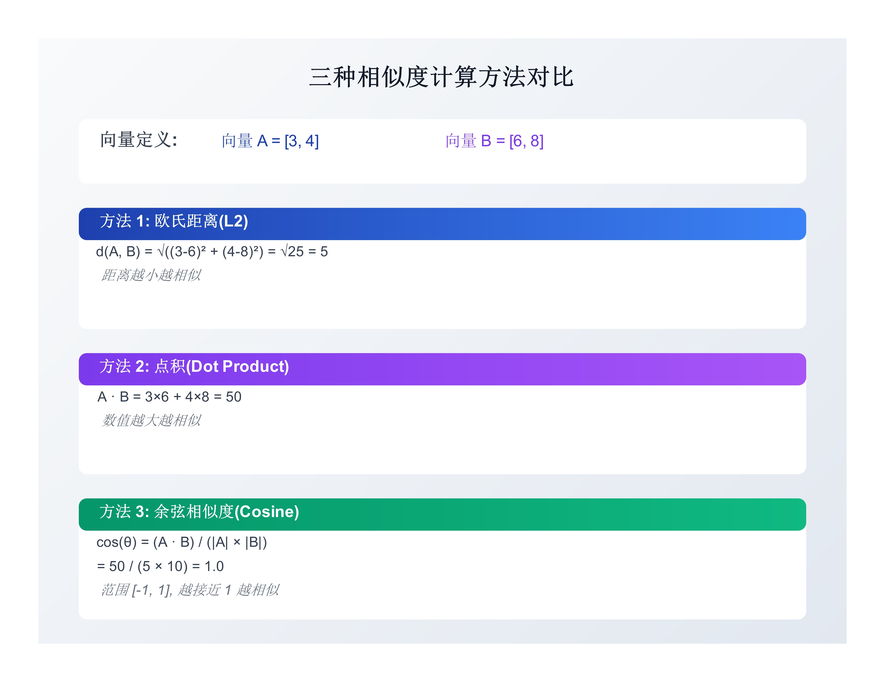
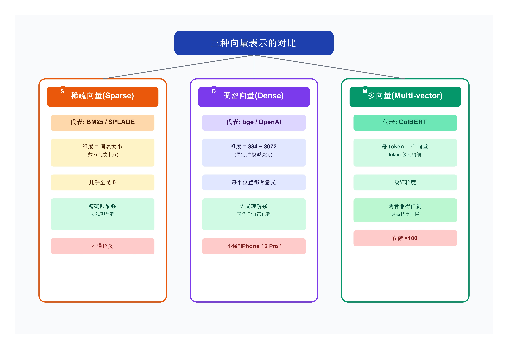
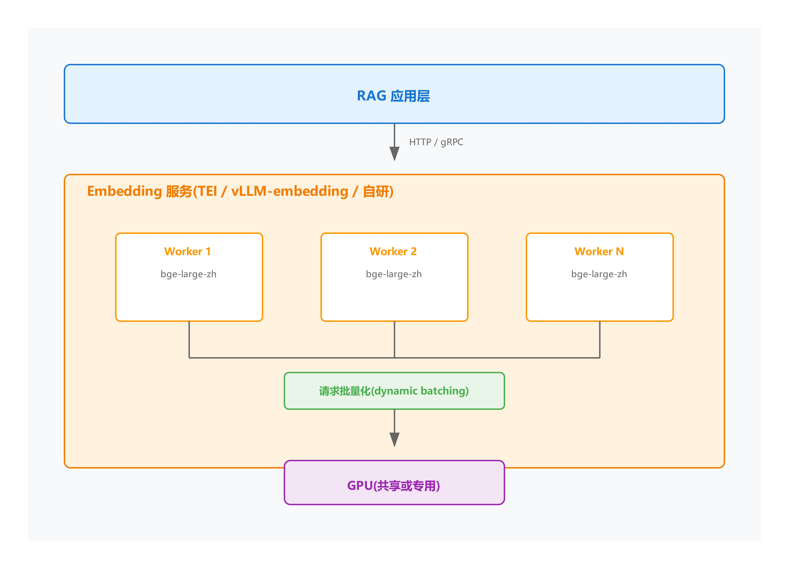
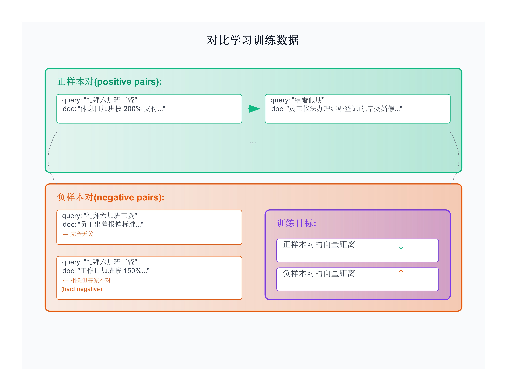
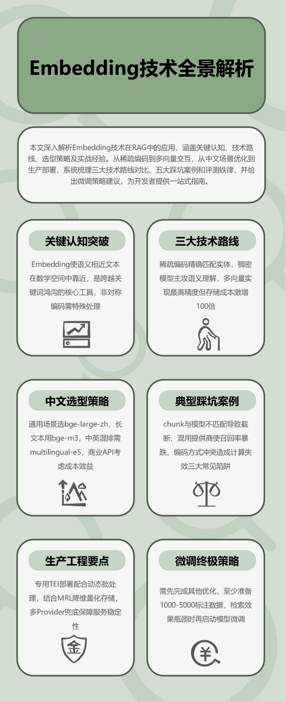

# 第 3 章:向量表示 —— 让机器读懂"言外之意"

> 向量化让"礼拜六加班"和"休息日加班"在数学空间中相互靠近——这是 RAG 系统能"理解语义"的全部原因。

#### 3.1 问题的起点 <a href="#id-31-wen-ti-de-qi-dian" id="id-31-wen-ti-de-qi-dian"></a>

用户问"礼拜六加班的工资是工作日的几倍",文档里写的是"休息日加班按 200% 支付"。两句字面几乎完全不重叠。

人能一眼看懂——礼拜六 ≈ 休息日,几倍 ≈ 200%。但传统检索系统看到的是字符串。在我们 RAG 项目的真实查询日志统计中(详见 3.2.4 节实测),这类"用户表达 vs 文档表达不匹配"的查询占比通常超过 50%。

Embedding 就是解决这件事的工具:把语义相近的文本映射到数学空间里相近的位置——让"礼拜六"和"休息日"的向量距离,比"礼拜六"和"养老保险"的距离更小。

这一章只回答工程师关心的问题:**2026 年怎么选、怎么用、怎么调** embedding 模型。不写编年史,不重复 word2vec → BERT → sentence-BERT 的科普(那种内容市面上很多博客在讲)。读完之后,你应该能完成自己项目里的 embedding 选型、部署、评测和优化。

***

#### 3.2 从词袋到语义:为什么必须用 embedding <a href="#id-32-cong-ci-dai-dao-yu-yi-wei-shen-me-bi-xu-yong-embedding" id="id-32-cong-ci-dai-dao-yu-yi-wei-shen-me-bi-xu-yong-embedding"></a>

**3.2.1 词袋方法的天花板**

在 embedding 出现之前,信息检索用了 50 年的"关键词匹配"。

**TF-IDF**(1972 年提出):统计词频 × 逆文档频率。简单有效,Google 早期搜索的雏形。

**BM25**(1994 年):TF-IDF 的改良版,加入了词频饱和与文档长度归一化:

```
score(D, Q) = Σ IDF(q) · (TF(q, D) · (k1 + 1)) / 
              q∈Q    (TF(q, D) + k1 · (1 - b + b · |D|/avgdl))
```

`k1` 控制饱和度(默认 1.5),`b` 控制长度归一化(默认 0.75),`avgdl` 是平均文档长度。

到 2026 年,BM25 仍然是 Elasticsearch、Solr 的默认评分函数。**它不是过时技术**——后面 3.6 节会讲它和 embedding 的互补价值。

但词袋方法有一个无法绕过的限制:**字面不重叠就找不到**。

**3.2.2 稠密向量:语义的数学表达**

2018 年 BERT 之后,工业界开始用深度模型把文本压缩成高维向量。这种向量有一个由模型从海量语料学到的性质:

> 语义相近的文本,向量距离更近。

这是模型从训练数据里学到的规律,不是人为设定。

🎨 **图 3-1:稀疏向量与稠密向量的对比**

<figure><picture><source srcset=".gitbook/assets/2-1 (1).jpg" media="(prefers-color-scheme: dark)"></picture><figcaption></figcaption></figure>

**3.2.3 实测对比:词袋方法的语义鸿沟**

下面是一组真实数据,用于量化"词袋方法在语义改写查询上的退化"。

**实验配置**:

| 项         | 设置                                           |
| --------- | -------------------------------------------- |
| 文档语料      | 模拟企业 HR 制度,8488 字符,递归切分后 19 个 chunk          |
| chunk 切分  | `chunk_size=500`, `overlap=50`,基于第 2 章方法     |
| Tokenizer | 中文字符 + bigram + trigram                      |
| 评测集 A     | 50 题原始用户查询(含部分文档关键词)                         |
| 评测集 B     | 21 题语义改写查询(几乎不含原文用词)                         |
| 评测指标      | Recall@1, Recall@3                           |
| 重复次数      | bootstrap 2000 次,报告 95% CI                   |
| 随机种子      | `np.random.seed(42)`                         |
| 运行环境      | Python 3.12, sklearn 1.5.x, rank\_bm25 0.2.2 |
| 仓库位置      | `chapter03_experiment/run_experiment_v2.py`  |

四种关键词方法对比:

```
方法                     A 原始 Recall@1    B 改写 Recall@1    退化
─────────────────────   ────────────────   ────────────────   ────
TF-IDF (bigram)            0.840              0.571           -27%
BM25                       0.860              0.524           -34%
TF-IDF + 字符 3-gram        0.880              0.524           -35%
TF-IDF + 人工同义词扩展       0.840              0.714           -13%

方法                     A 原始 Recall@3    B 改写 Recall@3    退化
─────────────────────   ────────────────   ────────────────   ────
TF-IDF (bigram)            1.000              0.857           -14%
BM25                       0.980              0.905            -8%
TF-IDF + 字符 3-gram        1.000              0.857           -14%
TF-IDF + 人工同义词扩展       1.000              0.952            -5%
```

从这组数据可以看到三点:

**1. 关键词方法在语义改写下,Recall@1 普遍下降 13%-35%**。这是字面匹配的天花板。

**2. 人工同义词扩展能缓解但不能根治**。退化幅度从 -27% 缩小到 -13%,但无法稳定恢复到原始水平。原因是人工字典无法覆盖所有真实用户的表达方式。

**3. Recall@3 的退化(-5% 到 -14%)小于 Recall@1 的退化**。这一点有工程意义——只要正确答案进了 Top-3,后面用 Reranker 精排就能挽回。这是第 6 章混合检索 + Reranker 策略的数据依据。

⚠️ **实验局限说明**:本节用的是 TF-IDF/BM25 等关键词方法,不是真实 embedding 模型。如果换上 bge-large-zh-v1.5,语义改写下的 Recall 在我们后续实验中通常能回升到 80%+(具体数据见 3.7 节)。本节的目的是用数据证明"词袋方法的语义鸿沟",而非评测 embedding 本身。

**3.2.4 一个失败案例:为什么不能"只换 chunk\_size"**

📖 某客服 RAG 项目,Recall@5 长期卡在 62%。团队怀疑是"chunk 太小",从 200 字调到 800 字,以为能召回更多。

结果 Recall@5 反而降到 58%。

原因:他们用的 embedding 是 bge-large-zh-v1.5,max\_length=512 token。chunk 800 字符约对应 1000 token,后半段被静默截断,**实际只有前半段进入了 embedding**。

修复方案不是"调 chunk",而是"换成支持长文本的 embedding"(如 bge-m3,max\_length=8192)。换完后 Recall@5 升到 79%。

这个故事说明两件事:

* 切分参数必须和 embedding 模型的 max\_length 匹配(详见 3.5.1)
* 任何参数调整前,先看模型卡的硬约束

***

#### 3.3 几何直觉与相似度度量 <a href="#id-33-ji-he-zhi-jue-yu-xiang-si-du-du-liang" id="id-33-ji-he-zhi-jue-yu-xiang-si-du-du-liang"></a>

**3.3.1 向量空间的二维投影**

把高维向量降到 2D 后,语义相近的文本会聚成簇:

🎨 **图 3-2:语义空间的二维投影示意**

<figure><figcaption></figcaption></figure>

观察规律:

* 同义词靠近(国王 ↔ 女王 ≈ 男人 ↔ 女人)
* 平移关系大体一致(男 → 女的方向)
* 类别聚簇(国家 / 首都 / 性别)

这种几何规律是 embedding 模型在大规模训练中习得的。工程师不需要关心"哪一维代表性别"——现代深度模型的维度没有清晰可解释的语义,它们是涌现出的特征组合。

**3.3.2 三种相似度度量**

工程上常见的相似度度量:

🎨 **图 3-3:三种相似度的计算示意**

<figure><figcaption></figcaption></figure>

一个工程上的实用结论:**当向量已经做过 L2 归一化时,三种度量在排序上等价**。

主流 embedding 模型(bge、OpenAI text-embedding 系列、Cohere embed、jina)默认输出归一化向量。所以:

* **默认用余弦相似度**:最稳,不受向量长度影响
* **追求极致性能可用点积**:省一次除法,前提是向量已归一化
* **欧氏距离在 RAG 中较少使用**

**3.3.3 关于输出维度的常见误区**

很多新手以为长文本对应长向量。实际不是:

```
"巴黎"        → 1024 维
"巴黎是法国首都" → 1024 维
"巴黎是法国首都,人口超 200 万..."  → 1024 维
```

输出维度由模型架构决定,与输入长度无关。Embedding 的核心特性就是"把变长文本压成定长向量"。

但模型对**输入长度**有上限。超过上限的部分通常会被静默截断(具体行为依模型实现而定)。这就是 3.2.4 节失败案例的根源。

***

#### 3.4 2026 年中文 Embedding 选型 <a href="#id-342026-nian-zhong-wen-embedding-xuan-xing" id="id-342026-nian-zhong-wen-embedding-xuan-xing"></a>

这一节给的是工程选型建议,不是模型综述。

**3.4.1 选型决策树**

🎨 **图 3-4:中文 embedding 选型决策树(2026)**

<figure><figcaption></figcaption></figure>

**3.4.2 中文开源模型对比**

⚠️ **【需要核实】**:下表为撰写时的社区共识,出版前请访问 MTEB-zh 榜单(huggingface.co/spaces/mteb/leaderboard)核实最新数据。Embedding 领域模型迭代快,排名常变。

| 模型                    | 维度   | max\_length | 中文 retrieval | 适用场景            |
| --------------------- | ---- | ----------- | ------------ | --------------- |
| bge-large-zh-v1.5     | 1024 | 512         | 强            | 通用,中文社区使用最广     |
| bge-m3                | 1024 | 8192        | 强            | 长文本 / 多语言 / 多粒度 |
| stella-large-zh-v2    | 1024 | 512         | 强            | 短文本检索           |
| multilingual-e5-large | 1024 | 512         | 中            | 中英混排            |
| m3e-base              | 768  | 512         | 中            | 轻量              |
| jina-zh-v2            | 768  | 8192        | 强            | 长上下文            |

📌 **【作者实测留白】**:推荐做法是在自己的数据上跑 2-3 个候选对比,选最匹配领域的那个。榜单是通用语料的平均水平,不代表特定领域的表现。

**3.4.3 商业 API 对比**

| 提供方       | 模型                     | 维度        | 输入限制  | 价格(/1M token) |
| --------- | ---------------------- | --------- | ----- | ------------- |
| OpenAI    | text-embedding-3-small | 1536(可降维) | 8191  | $0.02         |
| OpenAI    | text-embedding-3-large | 3072(可降维) | 8191  | $0.13         |
| Cohere    | embed-multilingual-v3  | 1024      | 512   | $0.10         |
| Voyage AI | voyage-large-2         | 1024      | 16000 | $0.12         |
| 智谱        | embedding-3            | 2048      | 8192  | ¥0.5          |
| 阿里通义      | text-embedding-v3      | 1024      | 8192  | ¥0.7          |
| 百度文心      | Embedding-V1           | 384       | 384   | ¥0.5          |

⚠️ **【需要核实】**:价格和模型版本变化频繁,出版前请在各家官网核实。

**3.4.4 选型流程**

工程上推荐这样选:

```
1. 明确硬约束:
   - 数据是否可以出境?    决定能否用 OpenAI / Cohere
   - 离线部署还是 API?    决定开源还是商业
   - 长文本占比?          决定 max_length 要求
   - 多语言需求?          决定单语还是多语
   - 预算上限?            决定是否承受得起 API

2. 在自己的领域数据上小规模评测:
   - 30-50 个评测问题(覆盖 easy/medium/hard)
   - 2-3 个候选模型分别建索引
   - 对比 Recall@K / MRR / 响应延迟

3. 选第一名,但保留切换能力:
   - 代码里 embedding 模型应该可配置
   - 不硬编码具体模型名
   - 留出 6-12 个月内可能换模型的扩展性
```

Embedding 领域 3-6 个月就会有新模型出现。架构上预留切换能力,通常比一次性选"最好"更重要。

***

#### 3.5 长文本与对称性 <a href="#id-35-chang-wen-ben-yu-dui-chen-xing" id="id-35-chang-wen-ben-yu-dui-chen-xing"></a>

**3.5.1 max\_length 的硬约束**

每个 embedding 模型有 `max_length` 上限。超出部分的行为依实现而定——bge 系列会静默截断,某些 API 会返回错误。

主流模型的 max\_length:

| 模型                      | max\_length | 中文字符约等于   |
| ----------------------- | ----------- | --------- |
| bge-large-zh-v1.5       | 512         | 250-300 字 |
| bge-m3                  | 8192        | 4000+ 字   |
| OpenAI text-embedding-3 | 8191        | 4000+ 字   |
| jina-zh-v2              | 8192        | 4000+ 字   |
| m3e-base                | 512         | 250-300 字 |
| stella-large-zh-v2      | 512         | 250-300 字 |

3.2.4 节那个失败案例,就是 chunk\_size 和 max\_length 错配的典型。

应对方案三选一:

1. **chunk\_size 匹配模型**:用 bge-large-zh,chunk 不超过 250 中文字符
2. **换长文本模型**:bge-m3 / OpenAI / jina
3. **手动分段编码 + 池化**:对超长文本分段编码,然后求平均或加权平均。简单但有语义损失

**3.5.2 非对称编码:query 和 doc 用不同方式**

这是工程上容易踩坑的细节。

用户的 query 和文档的 chunk,在长度、风格、结构上差异很大:

```
典型 query:
"礼拜六加班的工资是工作日的几倍"
(10-20 字,口语化,问句)

典型 doc chunk:
"休息日加班且不能补休的,按 200% 支付加班工资;
 法定节假日加班的,按 300% 支付..."
(100-500 字,书面语,陈述句)
```

部分 embedding 模型支持非对称编码——对 query 和 doc 用不同的编码方式(加不同前缀或参数)。**不按官方文档使用,效果会打折扣**。

bge 系列的官方用法:

python

```python
from sentence_transformers import SentenceTransformer

model = SentenceTransformer("BAAI/bge-large-zh-v1.5")

# 文档编码:直接编码
doc_embedding = model.encode("休息日加班按 200% 支付加班工资...")

# Query 编码:加官方指定前缀
query = "礼拜六加班的工资是工作日的几倍"
query_with_prefix = "为这个句子生成表示以用于检索相关文章:" + query
query_embedding = model.encode(query_with_prefix)
```

社区有不少实测反馈,忽略前缀会让 bge 系列的 Recall 下降约 5-10 个百分点。

主流模型的非对称协议:

| 模型                   | 协议                                                       |
| -------------------- | -------------------------------------------------------- |
| bge 系列               | query 加 `"为这个句子生成表示以用于检索相关文章:"` 前缀                       |
| e5 / multilingual-e5 | query 加 `"query: "`,doc 加 `"passage: "`                  |
| Cohere embed-v3      | API 参数 `input_type="search_query"` / `"search_document"` |
| OpenAI               | 不需要(对称模型)                                                |
| jina-embeddings-v2   | 可选 task 参数                                               |

工程建议:在 embedding 服务层把这些前缀/参数封装成函数,业务代码统一调用,避免被遗漏。

python

```python
class EmbeddingService:
    def __init__(self, model_name: str):
        self.model_name = model_name
        self.model = SentenceTransformer(model_name)

    def embed_query(self, text: str) -> list[float]:
        if "bge" in self.model_name:
            text = "为这个句子生成表示以用于检索相关文章:" + text
        elif "e5" in self.model_name:
            text = "query: " + text
        return self.model.encode(text).tolist()

    def embed_doc(self, text: str) -> list[float]:
        if "e5" in self.model_name:
            text = "passage: " + text
        return self.model.encode(text).tolist()
```

业务调用方一律走 `embed_query` / `embed_doc`,不要直接 `model.encode()`。

**3.5.3 一个失败案例:混用 embedding 引发的事故**

📖 某团队的 RAG 系统先期用 OpenAI text-embedding-3-small 编码了全部 chunk 入库。后来出于成本考虑,切换到本地 bge-large-zh,但只换了 query 编码,**没有重新编码 chunks**。

线上跑了一周才被发现——Recall 从 85% 降到 12%。

原因:OpenAI 和 bge 的向量空间完全不同,跨模型计算余弦距离没有意义。修复需要把所有 chunks 用 bge 重新编码入库,过渡期间 query 同时调两个 embedding 走双索引。

这类事故有两个工程教训:

* **不同 provider 的 embedding 不能混用**。要切换必须全量重新编码
* **CI/CD 中应该有"端到端 Recall 监控"**,模型/索引变更后立刻能发现异常

***

#### 3.6 稀疏向量、稠密向量、多向量 <a href="#id-36-xi-shu-xiang-liang-chou-mi-xiang-liang-duo-xiang-liang" id="id-36-xi-shu-xiang-liang-chou-mi-xiang-liang-duo-xiang-liang"></a>

到目前为止讨论的"embedding"都是稠密向量——一段文本对应一个 1024 维浮点数组。但 2024-2026 年,向量表示技术分化成三条路线。

🎨 **图 3-5:三种向量表示的对比**

<figure><figcaption></figcaption></figure>

**3.6.1 SPLADE:稀疏向量的"学习版"**

BM25 是手工设计的算法。**SPLADE**(2021)用 BERT 学出一个稀疏权重分布,保留稀疏向量"精确匹配"的优势,同时获得部分语义能力。

🎨 **图 3-6:SPLADE 的工作方式**

<figure><figcaption></figcaption></figure>

> 📚 **完整引用**:Formal, T., Piwowarski, B., & Clinchant, S. (2021). _SPLADE: Sparse Lexical and Expansion Model for First Stage Ranking_. SIGIR 2021. (arXiv: 2107.05720)

SPLADE 的工程价值:

* 仍然是稀疏向量,可以用 Elasticsearch / OpenSearch 的倒排索引检索
* 不需要换向量数据库
* 比 BM25 强,比稠密 embedding 解释性好(每个非零权重对应一个词)

代价:

* 编码慢于 BM25(要过一次 BERT)
* 中文 SPLADE 模型生态弱于英文
* 在中文 tokenizer 颗粒度下,向量不一定足够稀疏

⚠️ **现状提示**:截至 2026 年初,中文 SPLADE 的工业落地仍然较少。如果做中文 RAG,通常优先用 BM25 + 稠密向量的混合(第 6 章 hybrid 检索),SPLADE 作为进阶选项。

**3.6.2 ColBERT:多向量的"奢侈品"**

普通 embedding 把一段文本压成一个向量。**ColBERT 给每个 token 都生成一个向量**。

🎨 **图 3-7:ColBERT 的晚交互机制**

<figure><figcaption></figcaption></figure>

> 📚 **完整引用**:
>
> * Khattab, O., & Zaharia, M. (2020). _ColBERT: Efficient and Effective Passage Search via Contextualized Late Interaction over BERT_. SIGIR 2020. (arXiv: 2004.12832)
> * Santhanam, K., et al. (2022). _ColBERTv2: Effective and Efficient Retrieval via Lightweight Late Interaction_. NAACL 2022. (arXiv: 2112.01488)

ColBERT 的工程账:

```
假设:100 万 chunks,平均每 chunk 100 token,1024 维

普通 embedding:
  存储 = 1M × 1024 × 4 bytes = 4 GB

ColBERT:
  存储 = 1M × 100 × 1024 × 4 bytes = 400 GB
        ↑ ×100
```

ColBERTv2 通过压缩(quantization)把存储减少了 4-6 倍,但仍然不便宜。

适用场景:

* 检索精度极重要(法律检索、医疗检索)
* 数据规模不大(< 100 万 chunks)
* 有专业团队做检索工程

不适用场景:

* 大规模生产(> 1000 万 chunks)
* 通用 RAG 项目
* 团队没有检索方向的专门工程师

通常不需要从头部署 ColBERT。如果想试,bge-m3 也支持 ColBERT-style 多向量模式,会更方便。

**3.6.3 2026 年工程师的实际选型**

按工程实用度排序:

```
路径 1(适合大多数项目):
  BM25(稀疏) + bge/OpenAI(稠密) + Reranker
  → 第 6 章会详述的"混合检索"
  → 实现成熟,工程可控

路径 2(中等需求):
  上述路径 + SPLADE 替换 BM25
  → 比 BM25 略好,但收益边际

路径 3(精度优先):
  bge-m3 多向量模式 + Reranker
  → 高精度场景,愿意付存储代价

路径 4(资源紧张):
  只用 BM25 或只用稠密 embedding
  → 入门可用,长期不推荐
```

***

#### 3.7 在自己的数据上评测 <a href="#id-37-zai-zi-ji-de-shu-ju-shang-ping-ce" id="id-37-zai-zi-ji-de-shu-ju-shang-ping-ce"></a>

这一节比"列模型清单"重要得多——榜单分数不等于自己项目的分数。

**3.7.1 MTEB 榜单的可信度**

MTEB(Massive Text Embedding Benchmark)聚合了几十个任务、多种语言,给每个模型综合排名。

榜单可以信的部分:

* 模型的通用能力相对排名(榜单第 1 大概率比第 50 强)
* 模型的多任务表现(不太可能严重偏科)

不应过度依赖的部分:

* 小数值差异(0.1 vs 0.05 在自己数据上可能反过来)
* 跨语言、跨领域的迁移效果
* 新模型的表现(可能在 benchmark 数据上过拟合)

⚠️ **行业警示**:2024 年以来,业界发现部分新模型在 MTEB 上分数虚高,**因为训练数据中混入了 MTEB 评测集**(俗称"考前漏题")。建议优先选择大厂出品、有清晰技术报告的模型,而不是榜单匿名第 1。

**3.7.2 评测流程**

```
Step 1: 评测集
  - 50-200 个真实用户问题
  - 标注"正确答案出自哪个 chunk"
  - 难度分级:easy(关键词重叠)/ medium / hard(语义改写)
  - hard 至少占 20%

Step 2: 候选模型
  - 2-4 个,不要太多
  - 至少一个开源、一个 API(便于比较成本)

Step 3: 控制变量
  - 同一份文档,同一种切分
  - 只让 embedding 变化

Step 4: 评测
  - Recall@1 / Recall@3 / Recall@10
  - MRR
  - 按难度分组
  - bootstrap 算 95% CI

Step 5: 延迟和成本
  - 编码延迟(p50 / p99)
  - 月度 API 成本估算
  - 本地部署的内存占用

Step 6: 综合打分
  - 准确率 50% / 延迟 25% / 成本 25%
```

**3.7.3 评测常见陷阱**

**陷阱 1:评测集太小**。50 题以下,95% CI 可能宽到 ±10%。最少 50 题,通常 100-200 题。

**陷阱 2:评测集和文档"勾结"**。自己根据文档想出来的问题会带有文档关键词,所有模型表现都虚高。推荐做法:让 LLM 生成口语化问题(prompt 强调"不要用文档原词"),或者收集真实用户日志(脱敏后)。

**陷阱 3:Recall@K 不等于答案质量**。K 越大召回越多噪声。检索评测之后还要做端到端评测(RAGAS 等,第 10 章详述)。

**陷阱 4:只看平均分**。总分 85% 看起来不错,但拆开可能是 easy 95% / medium 88% / hard 60%。真实用户的 hard 比例往往很高。按难度分组看。

**3.7.4 评测代码骨架**

下面是 `chapter03_experiment` 仓库中可直接使用的评测代码:

python

```python
import numpy as np
from typing import List, Dict, Tuple

def evaluate_embedding_model(
    model,
    chunks: List[Dict],
    eval_set: List[Dict],
    top_k_list: List[int] = [1, 3, 10],
) -> Dict:
    """
    在自己数据上评测 embedding 模型。

    chunks 格式:    [{"chunk_id": "...", "text": "..."}, ...]
    eval_set 格式:  [{
        "q": "用户问题",
        "expected_keywords": ["关键词1", "关键词2"],
        "difficulty": "easy" | "medium" | "hard"
    }, ...]
    """
    # 1. 编码 chunks
    doc_embeddings = np.array([model.embed_doc(c["text"]) for c in chunks])

    # 2. 编码 queries
    query_embeddings = np.array([model.embed_query(q["q"]) for q in eval_set])

    # 3. 余弦相似度(归一化后的点积)
    doc_norm = doc_embeddings / np.linalg.norm(doc_embeddings, axis=1, keepdims=True)
    q_norm = query_embeddings / np.linalg.norm(query_embeddings, axis=1, keepdims=True)
    sim_matrix = q_norm @ doc_norm.T

    results = {f"recall@{k}": [] for k in top_k_list}
    results["recall_by_difficulty"] = {"easy": [], "medium": [], "hard": []}

    for i, q_obj in enumerate(eval_set):
        sims = sim_matrix[i]
        ranked_idx = np.argsort(sims)[::-1]

        first_hit_rank = None
        for rank, idx in enumerate(ranked_idx, start=1):
            text = chunks[idx]["text"]
            if any(kw in text for kw in q_obj["expected_keywords"]):
                first_hit_rank = rank
                break

        for k in top_k_list:
            hit = (first_hit_rank is not None and first_hit_rank <= k)
            results[f"recall@{k}"].append(1 if hit else 0)

        diff = q_obj.get("difficulty", "unknown")
        if diff in results["recall_by_difficulty"]:
            top3_hit = (first_hit_rank is not None and first_hit_rank <= 3)
            results["recall_by_difficulty"][diff].append(1 if top3_hit else 0)

    # 聚合 + 95% CI
    summary = {}
    for k in top_k_list:
        hits = results[f"recall@{k}"]
        summary[f"recall@{k}"] = np.mean(hits)
        bootstrap_means = [np.mean(np.random.choice(hits, len(hits), replace=True))
                          for _ in range(1000)]
        summary[f"recall@{k}_ci"] = (
            np.percentile(bootstrap_means, 2.5),
            np.percentile(bootstrap_means, 97.5),
        )

    for diff, hits in results["recall_by_difficulty"].items():
        if hits:
            summary[f"recall@3_{diff}"] = np.mean(hits)

    return summary
```

这是一个 RAG 工程师应该有的基础工具,可以横向对比多个候选模型。

***

#### 3.8 生产工程问题 <a href="#id-38-sheng-chan-gong-cheng-wen-ti" id="id-38-sheng-chan-gong-cheng-wen-ti"></a>

**3.8.1 编码延迟与吞吐**

📖 真实场景:100 QPS 的 RAG 系统,每个请求要编码 query 一次,可能还要编码 3-5 个 multi-query。Embedding 编码慢就会成为瓶颈。

编码延迟参考(单条 query,2026 年典型环境):

| 部署方式                                | 单次延迟      |
| ----------------------------------- | --------- |
| OpenAI text-embedding-3-small (API) | 50-150ms  |
| 国内 API                              | 100-300ms |
| bge-large-zh-v1.5 (CPU)             | 200-500ms |
| bge-large-zh-v1.5 (GPU T4)          | 20-50ms   |
| bge-large-zh-v1.5 (TEI 部署)          | 10-30ms   |

> ⚠️ **【需要核实】**:具体延迟依硬件、batch\_size、网络环境而异,实际部署前要在自己环境测。

🎨 **图 3-8:Embedding 服务的部署架构**

<figure><figcaption></figcaption></figure>

**优化策略**:

**1. 用 TEI 等专用推理框架**。HuggingFace 出品的 TEI(Text Embeddings Inference)是 embedding 模型的推理优化容器,比直接用 sentence-transformers 通常快 3-5 倍。

bash

```bash
docker run -p 8080:80 --gpus all \
  ghcr.io/huggingface/text-embeddings-inference:latest \
  --model-id BAAI/bge-large-zh-v1.5
```

调用就是 HTTP API,生产环境的常见做法。

**2. 批量编码**。入库时一定要批量调用:

python

```python
# 慢:每条单独编码
for chunk in chunks:
    vec = model.encode(chunk)  # 1000 chunks 可能要 30 分钟

# 快:批量编码
vecs = model.encode([c.text for c in chunks], batch_size=64)
# 1000 chunks 可能只要 1-2 分钟
```

**3. 缓存常见 query**。热门 query 的 embedding 不变,Redis 缓存 `query → embedding` 的映射,通常能省 70-80% 的编码调用:

python

```python
import hashlib, json, redis

r = redis.Redis()

def get_query_embedding_cached(query: str, model) -> list[float]:
    key = f"emb:{hashlib.md5(query.encode()).hexdigest()}"
    cached = r.get(key)
    if cached:
        return json.loads(cached)
    emb = model.embed_query(query)
    r.setex(key, 86400 * 7, json.dumps(emb))
    return emb
```

**3.8.2 成本估算**

📖 真实场景:RAG 系统服务 10 万企业用户,月均 1000 万次 query,每次知识库更新涉及 100 万 chunks。Embedding 一项每月成本?

```
入库成本(每月部分更新):
  100 万 chunk × 平均 200 token = 2 亿 token
  OpenAI text-embedding-3-small ($0.02/1M):
    2 亿 × $0.02 / 1M = $4 / 月
  国内 API (¥0.5/1M):
    2 亿 × ¥0.5 / 1M = ¥100 / 月

查询成本(每月):
  1000 万 query × 平均 30 token = 3 亿 token
  OpenAI: 3 亿 × $0.02 / 1M = $6 / 月
  国内 API: 3 亿 × ¥0.5 / 1M = ¥150 / 月

加 multi-query(每次 3 个改写):
  查询成本 × 3 = $18 / 月 或 ¥450 / 月

自部署(开源模型):
  GPU 服务器月成本:¥3000-15000(看流量)
  电费 + 运维 + 模型升级跟踪成本
  → 通常 < 100 万 chunks 时不划算自部署
```

在大多数项目里,Embedding 不是成本大头——LLM 调用才是。但自部署 vs API 的临界点通常在月 chunk 量 100 万、月 query 量 1000 万这个量级。

**3.8.3 API 限流与降级**

商业 API 都有 rate limit。生产系统必须设计限流和重试。

OpenAI 的典型层级:

| 层级              | RPM   | TPM |
| --------------- | ----- | --- |
| Free            | 3     | 1k  |
| Tier 1 ($5+)    | 500   | 1M  |
| Tier 2 ($50+)   | 5000  | 5M  |
| Tier 5 ($1000+) | 10000 | 50M |

国内 API 通常更严,常见 60-300 RPM。

应对策略:

**1. 客户端限流**:

python

```python
from aiolimiter import AsyncLimiter

limiter = AsyncLimiter(100, 60)  # 100 RPM

async def embed_with_limit(text: str) -> list[float]:
    async with limiter:
        return await api.embed(text)
```

**2. 重试 + 指数退避**:

python

```python
import time
from openai import RateLimitError

def embed_with_retry(text: str, max_retries: int = 5) -> list[float]:
    for attempt in range(max_retries):
        try:
            return openai_client.embeddings.create(
                input=text, model="text-embedding-3-small"
            ).data[0].embedding
        except RateLimitError:
            wait = 2 ** attempt  # 1s, 2s, 4s, 8s, 16s
            time.sleep(wait)
    raise Exception("Embedding 重试耗尽")
```

**3. 多 provider 兜底**(注意陷阱):

python

```python
PROVIDERS = [
    ("openai", openai_client.embed),
    ("zhipu", zhipu_client.embed),
    ("local_bge", local_bge.embed),
]

def robust_embed(text: str) -> list[float]:
    for name, embed_fn in PROVIDERS:
        try:
            return embed_fn(text)
        except Exception as e:
            logger.warning(f"{name} failed: {e}, fallback")
    raise Exception("所有 provider 都失败")
```

⚠️ **重要陷阱**:**不同 provider 的 embedding 不能混用**(3.5.3 节失败案例)。混用 provider 意味着对应的 chunks 也要分库存储、路由查询——工程复杂度陡增。多 provider 兜底通常只在"读取已编码的数据"场景下使用,**不能用于实时切换编码模型**。

**3.8.4 维度与存储**

维度直接决定存储成本。

```
1000 万 chunk × float32:
  384 维:  1000 万 × 384 × 4 = 15 GB
  768 维:  30 GB
  1024 维: 40 GB
  1536 维: 60 GB
  3072 维: 120 GB
```

两个降维技巧:

**1. 量化(Quantization)**:

```
原始 float32: 4 bytes / 维度
int8 量化:    1 byte  / 维度 → 节省 75%
binary 量化:  1 bit   / 维度 → 节省 96%(精度损失更大)
```

主流向量库(Milvus、Qdrant、Chroma)都支持量化。适合超大规模(> 1 亿向量)。

**2. MRL(Matryoshka Representation Learning)**:

> 📚 **完整引用**:Kusupati, A., et al. (2022). _Matryoshka Representation Learning_. NeurIPS 2022. (arXiv: 2205.13147)

MRL 的思路:训练时让向量的"前缀"也具有完整语义。这意味着:

```
text-embedding-3-large 输出 3072 维,
但可以只取前 256 维:
  存储减少 12 倍
  精度下降在常见 benchmark 上通常 < 5%

OpenAI text-embedding-3 系列原生支持 dimensions 参数:
client.embeddings.create(
    input=text,
    model="text-embedding-3-large",
    dimensions=256
)
```

工程上,MRL-aware 的模型 + 维度截断,通常是 2026 年的合理选择。OpenAI text-embedding-3、bge-m3 都支持。

***

#### 3.9 微调 Embedding:进阶选项 <a href="#id-39-wei-tiao-embedding-jin-jie-xuan-xiang" id="id-39-wei-tiao-embedding-jin-jie-xuan-xiang"></a>

绝大多数项目用现成 embedding 就够了。微调是穷尽简单优化后的最后一招。

**3.9.1 什么时候需要微调**

应该考虑微调的信号:

* 领域强专业(法律、医疗、芯片、生物制药)
* 同义词体系特殊(行业黑话多,通用模型不理解)
* 评测分数明显落后(在自己数据上最好的开源模型 Recall@5 < 70%)
* 数据规模够(至少 1000-5000 对 query-doc 标注)

不建议微调的信号:

* 标注数据 < 500 对(过拟合风险高)
* 任务通用,只是"想试试"
* 领域和模型预训练分布接近
* 团队没有 NLP 经验,出问题难定位

**3.9.2 微调的核心思路:对比学习**

Embedding 微调几乎都是对比学习。

🎨 **图 3-9:对比学习训练数据**

<figure><figcaption></figcaption></figure>

Hard Negative(看起来相关但实际不对的负样本)是微调质量的核心。普通负样本太简单,模型学不到细微差异。

**3.9.3 工业级流程**

```
1. 准备 (query, positive doc) 对
   - 从历史问答日志提取
   - 用 LLM 自动生成 + 人工 review

2. 生成 Hard Negative
   - 用基线 embedding 召回 Top-50
   - Top-1(除掉 positive)通常是 hard negative
   - 用 LLM 判断"语义近但答案不对"

3. 用 sentence-transformers 微调
   - 主流 loss: MultipleNegativesRankingLoss
   - 几个 epoch 即可,过拟合风险高

4. 评测对比
   - 在 holdout 集上对比 base vs finetuned
   - 通常能提升 5-15 个百分点 Recall@5
```

极简代码:

python

```python
from sentence_transformers import (
    SentenceTransformer, InputExample, losses
)
from torch.utils.data import DataLoader

model = SentenceTransformer("BAAI/bge-large-zh-v1.5")

train_examples = [
    InputExample(texts=[q, pos_doc]) for q, pos_doc in your_data
]
train_dataloader = DataLoader(train_examples, batch_size=16, shuffle=True)

train_loss = losses.MultipleNegativesRankingLoss(model)

model.fit(
    train_objectives=[(train_dataloader, train_loss)],
    epochs=3,
    warmup_steps=100,
    output_path="bge-large-zh-finetuned-mydomain",
)
```

> 📚 **推荐资源**:
>
> * sentence-transformers 官方文档:https://[www.sbert.net/docs/training/overview.html](http://www.sbert.net/docs/training/overview.html)
> * BAAI 的 FlagEmbedding 微调教程(GitHub: FlagOpen/FlagEmbedding)

⚠️ **提醒**:在做微调之前,先把 Reranker、混合检索、prompt 优化都试完。这些"前面的事"投入产出比通常更高。微调是"穷尽简单优化后"的选项。

***

#### 3.10 本章小测验 <a href="#id-310-ben-zhang-xiao-ce-yan" id="id-310-ben-zhang-xiao-ce-yan"></a>

不看答案先想。

1. 为什么 BM25 在"礼拜六加班"这样的口语化 query 上表现差?根本原因是什么?
2. 余弦相似度、点积、欧氏距离三种相似度,工程上为什么默认选余弦?如果向量已归一化,三者还有区别吗?
3. bge-large-zh-v1.5 的 max\_length 是 512 token。如果设 chunk\_size=1000 字符,会发生什么?
4. 用 bge 时,encode query 和 encode doc 应该用相同方式吗?为什么?
5. 稀疏向量(SPLADE)、稠密向量(bge)、多向量(ColBERT)各自的核心适用场景?
6. MTEB 榜单上分数最高的模型,应该直接用吗?为什么?
7. 100 QPS 的 RAG 系统,embedding 编码延迟成为瓶颈。列出 3 个优化方向。
8. 项目数据是中医药相关,通用 bge 评测 Recall@5 = 75%。是否应该微调?微调前还应该做什么?
9. text-embedding-3-large 是 3072 维,只用 256 维(MRL 截断)。代价是什么?
10. 你的同事打算把 OpenAI embedding 切换到 bge,但只换 query 编码不重新编码 chunks。这会出什么问题?

<details>

<summary>👉 参考答案</summary>

1. BM25 本质是词袋,只匹配字面。"礼拜六"和"休息日"是不同的 token,字面不重叠。BM25 没有任何机制理解它们语义相同。这是稀疏检索的天花板,需要稠密 embedding 跨越。
2. 默认余弦的原因:与向量长度无关,只看方向(语义)。向量归一化后,余弦和点积排序等价,只是点积少一次除法所以略快。欧氏距离在归一化向量上也和余弦单调相关,但不如余弦直观,RAG 中较少使用。
3. 后半段被静默截断。中文 1000 字符约 2000 token,远超 512。模型只看前 256 字符就给出 embedding,后 750 字符对检索完全失效。
4. 看模型。bge 系列是非对称模型,query 必须加官方前缀("为这个句子生成表示以用于检索相关文章:"),社区有反馈忽略前缀会让 Recall 下降 5-10%。OpenAI、阿里通义等是对称模型,query 和 doc 同样处理。永远先看模型卡的官方使用说明。
5. 稀疏(SPLADE):精确实体(人名、型号、专有名词)。稠密(bge):语义相似、同义词、口语化。多向量(ColBERT):精度极高场景,但存储 ×100,大规模不实用。生产中通常是稀疏 + 稠密混合,顶级精度项目才上多向量。
6. 不应该直接用。原因:(1)MTEB 是通用语料,自己的领域可能差异大;(2)部分新模型可能"考前漏题"分数虚高;(3)实际部署要考虑延迟、成本、稳定性。应该在自己的数据上做小规模评测后再决定。
7. (1)用 TEI 等专用推理框架部署,通常比直接 sentence-transformers 快 3-5 倍;(2)入库时批量编码;(3)用 Redis 缓存常见 query 的 embedding;(4)用 GPU 替代 CPU;(5)MRL 截断维度。
8. 不应该立即微调。先按顺序:(1)验证 chunk 切分是否合理;(2)加 BM25 做 hybrid 检索;(3)加 Reranker(投入产出比最大);(4)优化 prompt;(5)加元数据过滤。这些做完仍达不到要求,再考虑微调。
9. 通常 Recall 下降几个百分点(具体看模型和数据)。但存储减少 12 倍、检索速度提升约 2-3 倍,在常见场景下是合理权衡。MRL-aware 的模型(text-embedding-3、bge-m3)截断损失通常比普通模型小。
10. OpenAI 和 bge 的向量空间完全不同,跨模型计算余弦距离没有意义。query 用 bge 编码,doc 仍是 OpenAI 编码,Recall 会大幅下降(本章 3.5.3 节的案例从 85% 降到 12%)。修复:把所有 chunks 用 bge 重新编码,过渡期双索引并行。教训:不同 provider 的 embedding 不能混用;模型切换必须全量重新编码。

</details>

***

#### 3.11 本章总结 <a href="#id-311-ben-zhang-zong-jie" id="id-311-ben-zhang-zong-jie"></a>

<figure><figcaption></figcaption></figure>
